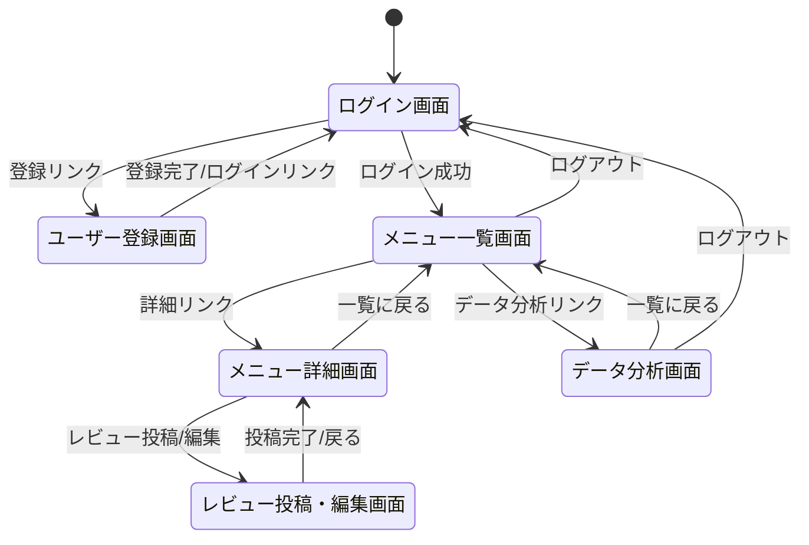
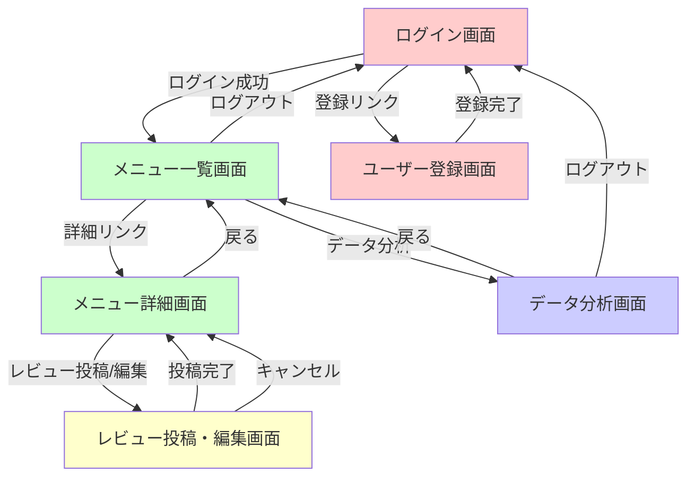
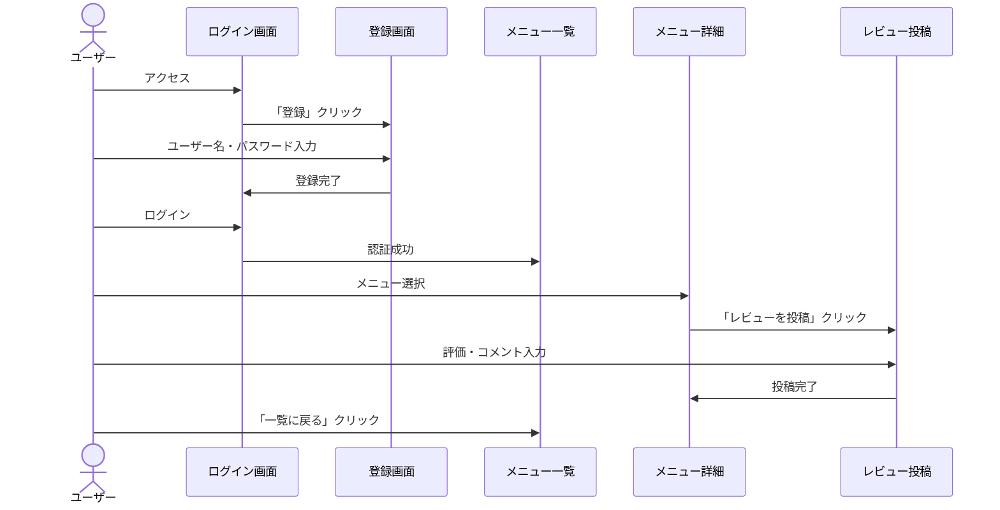
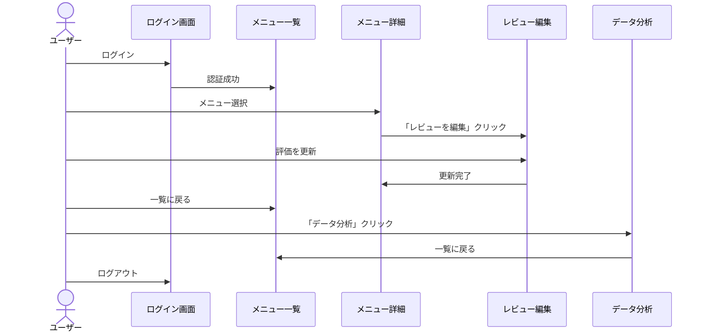

# 画面設計書

## 1. 概要

学食メニュー満足度アプリの画面設計書です。本アプリケーションは全6画面で構成され、ユーザー認証、メニュー閲覧、レビュー投稿、データ分析の機能を提供します。

## 2. 画面一覧

| 画面ID | 画面名 | URL | 認証 | 説明 |
|-------|-------|-----|------|------|
| SC-01 | ログイン画面 | `/login` | 不要 | ユーザーログイン |
| SC-02 | ユーザー登録画面 | `/register` | 不要 | 新規ユーザー登録 |
| SC-03 | メニュー一覧画面 | `/` | 必要 | メニューの一覧表示 |
| SC-04 | メニュー詳細画面 | `/menus/<id>` | 必要 | メニュー詳細とレビュー表示 |
| SC-05 | レビュー投稿・編集画面 | `/menus/<id>/review` | 必要 | レビューの投稿・編集 |
| SC-06 | データ分析画面 | `/analysis` | 必要 | レビューデータの可視化 |

## 3. 画面遷移図



## 4. 画面フロー図



## 5. 画面詳細設計

### SC-01: ログイン画面

#### 5.1.1 画面概要

- **URL**: `/login`
- **メソッド**: GET, POST
- **認証**: 不要
- **目的**: ユーザー認証を行い、システムへのアクセスを許可する

#### 5.1.2 画面レイアウト

```
+------------------------------------------+
|  学食メニュー満足度アプリ                  |
+------------------------------------------+
|                                          |
|           ログイン                        |
|                                          |
|  ユーザー名: [________________]          |
|                                          |
|  パスワード: [________________]          |
|                                          |
|         [ ログイン ]                     |
|                                          |
|  ユーザー登録                             |
|                                          |
+------------------------------------------+
```

#### 5.1.3 入力項目

| 項目名 | 必須 | 型 | 制約 | 説明 |
|-------|------|-----|------|------|
| username | ◯ | text | 最大100文字 | ユーザー名 |
| password | ◯ | password | - | パスワード（非表示） |

#### 5.1.4 動作

**GET:**
- ログインフォームを表示
- 既にログイン済みの場合はメニュー一覧へリダイレクト（オプション）

**POST:**
1. ユーザー名とパスワードを受け取る
2. データベースでユーザーを検索
3. パスワードのハッシュ値を検証
4. 認証成功 → セッションに `user_id` を保存し、メニュー一覧画面へ遷移
5. 認証失敗 → エラーメッセージを表示

#### 5.1.5 エラー処理

| エラー内容 | メッセージ |
|-----------|-----------|
| ユーザー名またはパスワードが不正 | 「ユーザー名またはパスワードが正しくありません」 |
| 入力項目が空 | 「全ての項目を入力してください」 |

#### 5.1.6 画面遷移

- **ユーザー登録リンク** → ユーザー登録画面（SC-02）
- **ログイン成功** → メニュー一覧画面（SC-03）

---

### SC-02: ユーザー登録画面

#### 5.2.1 画面概要

- **URL**: `/register`
- **メソッド**: GET, POST
- **認証**: 不要
- **目的**: 新規ユーザーアカウントを作成する

#### 5.2.2 画面レイアウト

```
+------------------------------------------+
|  学食メニュー満足度アプリ                  |
+------------------------------------------+
|                                          |
|         ユーザー登録                      |
|                                          |
|  ユーザー名: [________________]          |
|                                          |
|  パスワード: [________________]          |
|                                          |
|           [ 登録 ]                       |
|                                          |
|  ログイン                                 |
|                                          |
+------------------------------------------+
```

#### 5.2.3 入力項目

| 項目名 | 必須 | 型 | 制約 | 説明 |
|-------|------|-----|------|------|
| username | ◯ | text | 最大100文字、一意 | ユーザー名 |
| password | ◯ | password | - | パスワード（非表示） |

#### 5.2.4 動作

**GET:**
- ユーザー登録フォームを表示

**POST:**
1. ユーザー名とパスワードを受け取る
2. ユーザー名の重複チェック
3. パスワードをハッシュ化
4. 新規ユーザーをデータベースに登録
5. 登録成功 → ログイン画面へ遷移
6. 登録失敗 → エラーメッセージを表示

#### 5.2.5 バリデーション

| 項目 | チェック内容 | エラーメッセージ |
|-----|------------|----------------|
| username | 空欄チェック | 「全ての項目を入力してください」 |
| username | 重複チェック | 「そのユーザー名は既に使用されています」 |
| password | 空欄チェック | 「全ての項目を入力してください」 |

#### 5.2.6 画面遷移

- **ログインリンク** → ログイン画面（SC-01）
- **登録成功** → ログイン画面（SC-01）

---

### SC-03: メニュー一覧画面

#### 5.3.1 画面概要

- **URL**: `/`
- **メソッド**: GET
- **認証**: 必要
- **目的**: 学食メニューの一覧を表示し、詳細画面への入り口を提供する

#### 5.3.2 画面レイアウト

```
+------------------------------------------------------+
|  学食メニュー満足度アプリ                              |
|  ログイン中: ユーザー名                                |
+------------------------------------------------------+
|  [メニュー一覧] [データ分析] [ログアウト]              |
+------------------------------------------------------+
|  メニュー一覧                                         |
|                                                      |
|  カテゴリ                                             |
|  ・定食 ・丼もの ・麺類 ・カレー ・軽食 ・デザート     |
|                                                      |
|  +------------------------------------------------+  |
|  |メニュー名     |カテゴリ|価格|評価|件数|詳細    |  |
|  +------------------------------------------------+  |
|  |唐揚げ定食     |定食    |500 |4.5 |10  |[詳細] |  |
|  |カレーライス   |カレー  |400 |4.2 |8   |[詳細] |  |
|  |ラーメン       |麺類    |450 |4.0 |5   |[詳細] |  |
|  +------------------------------------------------+  |
|                                                      |
+------------------------------------------------------+
```

#### 5.3.3 表示項目

**ナビゲーション:**
- ログイン中のユーザー名
- メニュー一覧リンク（現在のページ）
- データ分析リンク
- ログアウトリンク

**カテゴリ一覧:**
- データベースに登録された全カテゴリを表示

**メニュー一覧テーブル:**

| カラム | 説明 |
|-------|------|
| メニュー名 | メニューの名前 |
| カテゴリ | 所属カテゴリ名 |
| 価格 | 価格（円） |
| 平均評価 | レビューの平均評価（0-5.0、小数点1桁） |
| レビュー数 | レビュー件数 |
| 詳細 | メニュー詳細画面へのリンク |

#### 5.3.4 動作

1. セッションから `user_id` を取得
2. ログインチェック（未ログインの場合はログイン画面へリダイレクト）
3. 提供中のメニュー（`is_available = TRUE`）を全て取得
4. 各メニューの平均評価とレビュー数を計算
5. カテゴリ一覧を取得
6. データを画面に表示

#### 5.3.5 計算ロジック

**平均評価:**
```python
reviews = Review.query.filter_by(menu_id=menu.id).all()
if reviews:
    avg_rating = sum(r.rating for r in reviews) / len(reviews)
    avg_rating = round(avg_rating, 1)
else:
    avg_rating = 0
```

#### 5.3.6 画面遷移

- **詳細リンク** → メニュー詳細画面（SC-04）
- **データ分析リンク** → データ分析画面（SC-06）
- **ログアウトリンク** → ログイン画面（SC-01）

---

### SC-04: メニュー詳細画面

#### 5.4.1 画面概要

- **URL**: `/menus/<id>`
- **メソッド**: GET
- **認証**: 必要
- **目的**: メニューの詳細情報と全レビューを表示する

#### 5.4.2 画面レイアウト

```
+------------------------------------------------------+
|  学食メニュー満足度アプリ                              |
|  ログイン中: ユーザー名                                |
+------------------------------------------------------+
|  [メニュー一覧に戻る]                                  |
|                                                      |
|  唐揚げ定食                                           |
|                                                      |
|  カテゴリ: 定食                                       |
|  価格: 500円                                          |
|  説明: ジューシーな唐揚げの定食                        |
|  平均評価: 4.5 (10件)                                 |
|  味: 4.7 / 量: 4.3 / コスパ: 4.5                     |
|                                                      |
|  [レビューを投稿] または [レビューを編集]              |
|                                                      |
|  レビュー一覧                                         |
|  +------------------------------------------------+  |
|  |ユーザー|評価|味|量|コスパ|コメント  |日時        |  |
|  +------------------------------------------------+  |
|  |太郎    |5   |5 |4 |5    |美味しい  |2025-11-10 |  |
|  |花子    |4   |5 |4 |4    |良い      |2025-11-09 |  |
|  +------------------------------------------------+  |
|                                                      |
+------------------------------------------------------+
```

#### 5.4.3 表示項目

**メニュー情報:**

| 項目 | 説明 |
|-----|------|
| メニュー名 | メニューの名前 |
| カテゴリ | 所属カテゴリ名 |
| 価格 | 価格（円） |
| 説明 | メニューの説明（あれば） |
| 平均評価（総合） | レビューの総合評価の平均 |
| レビュー数 | レビューの件数 |
| 平均評価（味） | 味の評価の平均（入力者のみ） |
| 平均評価（量） | 量の評価の平均（入力者のみ） |
| 平均評価（コスパ） | コスパ評価の平均（入力者のみ） |

**レビュー一覧テーブル:**

| カラム | 説明 |
|-------|------|
| ユーザー名 | レビュー投稿者 |
| 総合評価 | 1-5の評価 |
| 味 | 味の評価（未入力は「-」） |
| 量 | 量の評価（未入力は「-」） |
| コスパ | コスパ評価（未入力は「-」） |
| コメント | レビューコメント（未入力は「-」） |
| 投稿日時 | レビュー投稿日時 |

#### 5.4.4 動作

1. セッションから `user_id` を取得してログインチェック
2. URL パラメータから `menu_id` を取得
3. メニュー情報を取得（存在しない場合は404エラー）
4. 該当メニューの全レビューを新しい順に取得
5. 平均評価を計算（総合、味、量、コスパ）
6. ログインユーザーが既にレビュー済みかチェック
7. データを画面に表示

#### 5.4.5 計算ロジック

**詳細評価の平均:**
```python
# 味の平均（値がある場合のみ）
reviews_with_taste = [r for r in reviews if r.taste_rating]
if reviews_with_taste:
    avg_taste = sum(r.taste_rating for r in reviews_with_taste) / len(reviews_with_taste)
else:
    avg_taste = 0
```

#### 5.4.6 条件分岐

- **ユーザーが未レビュー**: 「レビューを投稿」ボタンを表示
- **ユーザーが既レビュー**: 「レビューを編集」ボタンを表示

#### 5.4.7 画面遷移

- **メニュー一覧に戻る** → メニュー一覧画面（SC-03）
- **レビューを投稿/編集** → レビュー投稿・編集画面（SC-05）

---

### SC-05: レビュー投稿・編集画面

#### 5.5.1 画面概要

- **URL**: `/menus/<id>/review`
- **メソッド**: GET, POST
- **認証**: 必要
- **目的**: メニューに対するレビューを投稿または編集する

#### 5.5.2 画面レイアウト

```
+------------------------------------------------------+
|  学食メニュー満足度アプリ                              |
|  ログイン中: ユーザー名                                |
+------------------------------------------------------+
|  [メニュー詳細に戻る]                                  |
|                                                      |
|  唐揚げ定食 - レビュー投稿                             |
|                                                      |
|  総合評価 (必須): [5 - 最高 ▼]                        |
|                                                      |
|  味の評価:       [選択しない ▼]                       |
|                                                      |
|  量の評価:       [選択しない ▼]                       |
|                                                      |
|  コスパの評価:   [選択しない ▼]                       |
|                                                      |
|  コメント:                                            |
|  +--------------------------------------+            |
|  |                                      |            |
|  |                                      |            |
|  +--------------------------------------+            |
|                                                      |
|           [ 投稿 ] または [ 更新 ]                   |
|                                                      |
+------------------------------------------------------+
```

#### 5.5.3 入力項目

| 項目名 | 必須 | 型 | 選択肢 | 説明 |
|-------|------|-----|--------|------|
| rating | ◯ | select | 1-5 | 総合評価 |
| taste_rating | - | select | 未選択、1-5 | 味の評価 |
| volume_rating | - | select | 未選択、1-5 | 量の評価 |
| price_rating | - | select | 未選択、1-5 | コスパの評価 |
| comment | - | textarea | - | コメント |

**評価の選択肢:**
- `5 - 最高`
- `4 - 良い`
- `3 - 普通`
- `2 - イマイチ`
- `1 - 悪い`

#### 5.5.4 動作

**GET:**
1. セッションから `user_id` を取得してログインチェック
2. URL パラメータから `menu_id` を取得
3. メニュー情報を取得
4. 既存レビューをチェック
5. 既存レビューがあればフォームに値を設定（編集モード）
6. フォームを表示

**POST:**
1. フォームデータを受け取る
2. バリデーション（総合評価は必須、範囲チェック）
3. 既存レビューの有無をチェック
4. **既存レビューがある場合:**
   - レビューを更新（UPDATE）
   - メッセージ: 「レビューを更新しました」
5. **既存レビューがない場合:**
   - 新規レビューを作成（INSERT）
   - メッセージ: 「レビューを投稿しました」
6. メニュー詳細画面へリダイレクト

#### 5.5.5 バリデーション

| 項目 | チェック内容 | エラーメッセージ |
|-----|------------|----------------|
| rating | 必須チェック | 「総合評価は必須です」 |
| rating | 範囲チェック（1-5） | 「評価は1〜5の範囲で入力してください」 |
| taste_rating | 範囲チェック（1-5、NULL可） | 「評価は1〜5の範囲で入力してください」 |
| volume_rating | 範囲チェック（1-5、NULL可） | 「評価は1〜5の範囲で入力してください」 |
| price_rating | 範囲チェック（1-5、NULL可） | 「評価は1〜5の範囲で入力してください」 |

#### 5.5.6 ビジネスルール

- 1ユーザーは1メニューに対して1レビューまで
- 既にレビューが存在する場合は自動的に編集モードになる
- 総合評価は必須、その他の評価とコメントは任意
- 空文字のコメントは NULL として保存

#### 5.5.7 画面遷移

- **メニュー詳細に戻る** → メニュー詳細画面（SC-04）
- **投稿/更新完了** → メニュー詳細画面（SC-04）

---

### SC-06: データ分析画面

#### 5.6.1 画面概要

- **URL**: `/analysis`
- **メソッド**: GET
- **認証**: 必要
- **目的**: レビューデータを可視化し、統計情報を提供する

#### 5.6.2 画面レイアウト

```
+------------------------------------------------------+
|  学食メニュー満足度アプリ                              |
|  ログイン中: ユーザー名                                |
+------------------------------------------------------+
|  [メニュー一覧] [データ分析] [ログアウト]              |
+------------------------------------------------------+
|  データ分析ダッシュボード                              |
|                                                      |
|  [メニュー一覧に戻る]                                  |
|                                                      |
|  +------------------------------------------------+  |
|  | 話題メニュー TOP10                             |  |
|  |                                                |  |
|  |  唐揚げ定食     ████████████ 15件             |  |
|  |  カレーライス   ██████████ 12件               |  |
|  |  ラーメン       ████████ 10件                 |  |
|  |  ...                                           |  |
|  |                                                |  |
|  +------------------------------------------------+  |
|                                                      |
+------------------------------------------------------+
```

#### 5.6.3 表示項目

**グラフ:**

1. **話題メニュー TOP10（横棒グラフ）**
   - レビュー数が多いメニューをランキング形式で表示
   - X軸: レビュー数
   - Y軸: メニュー名

#### 5.6.4 動作

1. セッションから `user_id` を取得してログインチェック
2. 全レビューデータを取得
3. レビューが0件の場合は「レビューデータがまだありません」と表示
4. レビューデータを Pandas DataFrame に変換
5. 各種グラフを生成
6. グラフを Base64 エンコードして HTML に埋め込み
7. 画面に表示

#### 5.6.5 データ処理フロー


#### 5.6.6 技術詳細

**使用ライブラリ:**
- `pandas`: データ処理
- `matplotlib`: グラフ生成
- `base64`: 画像エンコード

**グラフ生成プロセス:**
```python
# 1. データ集計
menu_counts = df['menu_name'].value_counts().head(10)

# 2. グラフ作成
fig, ax = plt.subplots(figsize=(10, 6))
menu_counts.plot(kind='barh', ax=ax, color='lightgreen')

# 3. Base64エンコード
buf = io.BytesIO()
fig.savefig(buf, format='png', bbox_inches='tight')
img_base64 = base64.b64encode(buf.read()).decode('utf-8')

# 4. HTMLに埋め込み

```

#### 5.6.7 画面遷移

- **メニュー一覧に戻る** → メニュー一覧画面（SC-03）
- **ログアウト** → ログイン画面（SC-01）

---

## 6. 共通仕様

### 6.1 認証・セッション管理

#### 6.1.1 セッション

- Flask のセッション機能を使用
- セッションキーは `user_id`
- ログイン時にセッションに保存、ログアウト時に削除

#### 6.1.2 ログインチェック

認証が必要な画面では以下のチェックを実行:
```python
if 'user_id' not in session:
    return redirect(url_for('auth.login'))
```

対象画面:
- SC-03: メニュー一覧画面
- SC-04: メニュー詳細画面
- SC-05: レビュー投稿・編集画面
- SC-06: データ分析画面

### 6.2 ナビゲーション

#### 6.2.1 共通ナビゲーション（認証後）

すべての認証後画面に表示:
```
[メニュー一覧] [データ分析] [ログアウト]
```

#### 6.2.2 ユーザー名表示

ログイン中のユーザー名を画面上部に表示:
```
ログイン中: {username}
```

### 6.3 メッセージ表示

#### 6.3.1 フラッシュメッセージ

Flask の `flash()` 機能を使用してユーザーにメッセージを表示。

**成功メッセージ:**
- 「登録が完了しました。ログインしてください」
- 「ログインしました」
- 「レビューを投稿しました」
- 「レビューを更新しました」
- 「ログアウトしました」

**エラーメッセージ:**
- 「全ての項目を入力してください」
- 「そのユーザー名は既に使用されています」
- 「ユーザー名またはパスワードが正しくありません」
- 「評価は1〜5の範囲で入力してください」

#### 6.3.2 表示位置

base.html で全画面共通の表示エリアを定義:
```html

  
    <div class="flash-messages">
      
        <p>{{ message }}</p>
      
    </div>
  

```

### 6.4 エラーハンドリング

#### 6.4.1 404 エラー

存在しないメニューにアクセスした場合:
```python
menu = Menu.query.get_or_404(id)
```

#### 6.4.2 認証エラー

未ログイン状態で認証が必要な画面にアクセス:
- ログイン画面へリダイレクト

## 7. 画面遷移パターン

### 7.1 初回ユーザーの典型的なフロー



### 7.2 既存ユーザーの典型的なフロー



---

## 8. UI/UXガイドライン

### 8.1 ボタンスタイル

| ボタン種別 | クラス名 | 用途 |
|----------|---------|------|
| プライマリ | `.btn-primary` | メインアクション（ログイン、登録、投稿等） |
| セカンダリ | `.btn-secondary` | サブアクション（キャンセル、戻る等） |
| リンク | `<a>` | 画面遷移（詳細、編集等） |

### 8.2 テーブルスタイル

- 境界線: `border="1"` （シンプルな枠線）
- ヘッダー: `<thead>` で定義
- データ行: `<tbody>` で定義

### 8.3 フォームレイアウト

- テーブルレイアウトで整列
- ラベル: 左側セル（`<th>`）
- 入力欄: 右側セル（`<td>`）

### 8.4 カラースキーム

- 背景色: 白
- テキスト: 黒
- リンク: 青
- ボタン: システム標準（ブラウザ依存）

### 8.5 フォント

- 日本語: システムフォント
- グラフ: MS Gothic / Yu Gothic / Meiryo

---

## 9. アクセシビリティ

### 9.1 フォーム

- すべての入力欄に `<label>` を設定
- 必須項目には `required` 属性を設定
- パスワード入力は `type="password"` で非表示

### 9.2 エラーメッセージ

- フラッシュメッセージで明確に表示
- ユーザーが理解しやすい日本語で記述

### 9.3 ナビゲーション

- 画面遷移リンクを明確に配置
- 「戻る」リンクを提供

---
