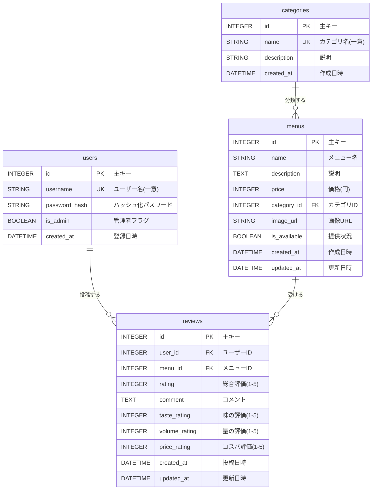

# テーブル設計書

## 1. 概要

学食メニュー満足度アプリのデータベース設計書です。本システムでは、ユーザー管理、メニュー管理、カテゴリ管理、レビュー管理の4つの主要なテーブルで構成されています。

## 2. ER図

## 3. テーブル定義詳細

### 3.1 users（ユーザー）

ユーザーアカウント情報を管理するテーブル。

| カラム名 | データ型 | 制約 | 説明 |
|---------|---------|------|------|
| id | INTEGER | PRIMARY KEY | 主キー（自動採番） |
| username | VARCHAR(100) | NOT NULL, UNIQUE | ユーザー名（重複不可） |
| password_hash | VARCHAR(200) | NOT NULL | ハッシュ化されたパスワード |
| is_admin | BOOLEAN | DEFAULT FALSE | 管理者権限フラグ |
| created_at | DATETIME | DEFAULT CURRENT_TIMESTAMP | アカウント作成日時 |

**インデックス:**
- PRIMARY KEY: `id`
- UNIQUE INDEX: `username`

**リレーション:**
- reviews テーブルと 1:N の関係（1ユーザーが複数レビューを投稿可能）

**備考:**
- パスワードは Werkzeug の `generate_password_hash` でハッシュ化して保存
- `check_password_hash` で認証時にパスワード検証

---

### 3.2 categories（カテゴリ）

メニューのカテゴリ情報を管理するテーブル。

| カラム名 | データ型 | 制約 | 説明 |
|---------|---------|------|------|
| id | INTEGER | PRIMARY KEY | 主キー（自動採番） |
| name | VARCHAR(50) | NOT NULL, UNIQUE | カテゴリ名（重複不可） |
| description | VARCHAR(200) | NULL | カテゴリの説明 |
| created_at | DATETIME | DEFAULT CURRENT_TIMESTAMP | 作成日時 |

**インデックス:**
- PRIMARY KEY: `id`
- UNIQUE INDEX: `name`

**リレーション:**
- menus テーブルと 1:N の関係（1カテゴリに複数メニューが所属）

**カテゴリ例:**
- 定食
- 丼もの
- 麺類
- カレー
- 軽食
- デザート

---

### 3.3 menus（メニュー）

学食のメニュー情報を管理するテーブル。

| カラム名 | データ型 | 制約 | 説明 |
|---------|---------|------|------|
| id | INTEGER | PRIMARY KEY | 主キー（自動採番） |
| name | VARCHAR(100) | NOT NULL | メニュー名 |
| description | TEXT | NULL | メニューの詳細説明 |
| price | INTEGER | NOT NULL | 価格（円単位） |
| category_id | INTEGER | NOT NULL, FOREIGN KEY | カテゴリID |
| image_url | VARCHAR(300) | NULL | メニュー画像のURL |
| is_available | BOOLEAN | DEFAULT TRUE | 提供中フラグ |
| created_at | DATETIME | DEFAULT CURRENT_TIMESTAMP | 登録日時 |
| updated_at | DATETIME | DEFAULT CURRENT_TIMESTAMP | 最終更新日時 |

**インデックス:**
- PRIMARY KEY: `id`
- FOREIGN KEY: `category_id` → categories(id)

**リレーション:**
- categories テーブルと N:1 の関係
- reviews テーブルと 1:N の関係（1メニューに複数レビューが投稿可能）

**備考:**
- `is_available = FALSE` のメニューは一覧画面に表示されない
- `updated_at` は更新時に自動的に現在日時に更新される

---

### 3.4 reviews（レビュー）

ユーザーがメニューに投稿したレビュー情報を管理するテーブル。

| カラム名 | データ型 | 制約 | 説明 |
|---------|---------|------|------|
| id | INTEGER | PRIMARY KEY | 主キー（自動採番） |
| user_id | INTEGER | NOT NULL, FOREIGN KEY | ユーザーID |
| menu_id | INTEGER | NOT NULL, FOREIGN KEY | メニューID |
| rating | INTEGER | NOT NULL, CHECK(1-5) | 総合評価（1〜5の整数） |
| comment | TEXT | NULL | レビューコメント |
| taste_rating | INTEGER | NULL, CHECK(1-5) | 味の評価（1〜5の整数） |
| volume_rating | INTEGER | NULL, CHECK(1-5) | 量の評価（1〜5の整数） |
| price_rating | INTEGER | NULL, CHECK(1-5) | コスパの評価（1〜5の整数） |
| created_at | DATETIME | DEFAULT CURRENT_TIMESTAMP | 投稿日時 |
| updated_at | DATETIME | DEFAULT CURRENT_TIMESTAMP | 最終更新日時 |

**インデックス:**
- PRIMARY KEY: `id`
- FOREIGN KEY: `user_id` → users(id)
- FOREIGN KEY: `menu_id` → menus(id)
- UNIQUE INDEX: `(user_id, menu_id)` （複合ユニーク制約）

**リレーション:**
- users テーブルと N:1 の関係
- menus テーブルと N:1 の関係

**制約:**
- `(user_id, menu_id)` の組み合わせは一意（1ユーザーは1メニューに対して1レビューまで）
- 評価値は 1〜5 の範囲内

**備考:**
- 必須項目は `rating`（総合評価）のみ
- 詳細評価（味・量・コスパ）とコメントは任意
- 既存レビューがある場合は編集（UPDATE）が可能

---

## 4. リレーションシップ詳細

### 4.1 users → reviews（1:N）

- 1人のユーザーは複数のレビューを投稿できる
- ユーザー削除時は関連するレビューも削除（CASCADE）

### 4.2 categories → menus（1:N）

- 1つのカテゴリには複数のメニューが所属できる
- カテゴリ削除時は関連するメニューの扱いは未定義（要検討）

### 4.3 menus → reviews（1:N）

- 1つのメニューには複数のレビューが投稿される
- メニュー削除時は関連するレビューも削除（CASCADE）

### 4.4 users × menus → reviews（N:M）

- users と menus は reviews テーブルを介して多対多の関係
- ただし、1ユーザーは1メニューに対して1レビューのみ（UNIQUE制約）

---

## 5. データベース操作のビジネスルール

### 5.1 ユーザー登録

- ユーザー名の重複チェック必須
- パスワードは必ずハッシュ化して保存
- デフォルトで `is_admin = FALSE`

### 5.2 レビュー投稿

- 1ユーザーは1メニューに対して1レビューまで
- 既にレビューが存在する場合は更新処理
- `rating` は必須、他の評価項目は任意

### 5.3 平均評価の計算

- メニューの平均評価は reviews テーブルから動的に計算
- レビューが0件の場合は評価0として表示
- 詳細評価（味・量・コスパ）は値がある場合のみ平均を計算

### 5.4 データ削除

- ユーザー削除時: 関連レビューも削除（CASCADE）
- メニュー削除時: 関連レビューも削除（CASCADE）
- カテゴリ削除時: メニューが存在する場合は削除不可（要検討）

---

## 6. インデックス戦略

### 6.1 主要クエリとインデックス

| クエリ内容 | 使用インデックス |
|-----------|----------------|
| ユーザー名でログイン | users.username (UNIQUE) |
| メニュー一覧取得 | menus.is_available |
| カテゴリ別メニュー取得 | menus.category_id |
| メニューのレビュー取得 | reviews.menu_id |
| ユーザーのレビュー取得 | reviews.user_id |
| ユーザー×メニューのレビュー確認 | reviews.(user_id, menu_id) (UNIQUE) |

### 6.2 推奨される追加インデックス

規模が大きくなった場合に追加を検討:
- `menus.is_available` - メニュー一覧の高速化
- `reviews.created_at` - レビュー新着順ソートの高速化

---

## 7. データ整合性

### 7.1 外部キー制約

すべての外部キー参照で参照整合性を保証:
- `menus.category_id` → `categories.id`
- `reviews.user_id` → `users.id`
- `reviews.menu_id` → `menus.id`

### 7.2 一意性制約

- `users.username`: ユーザー名の重複防止
- `categories.name`: カテゴリ名の重複防止
- `reviews.(user_id, menu_id)`: 1ユーザー1メニュー1レビュー制約

### 7.3 CHECK制約

- `reviews.rating`: 1〜5の範囲チェック
- `reviews.taste_rating`: 1〜5の範囲チェック（NULL許可）
- `reviews.volume_rating`: 1〜5の範囲チェック（NULL許可）
- `reviews.price_rating`: 1〜5の範囲チェック（NULL許可）

---